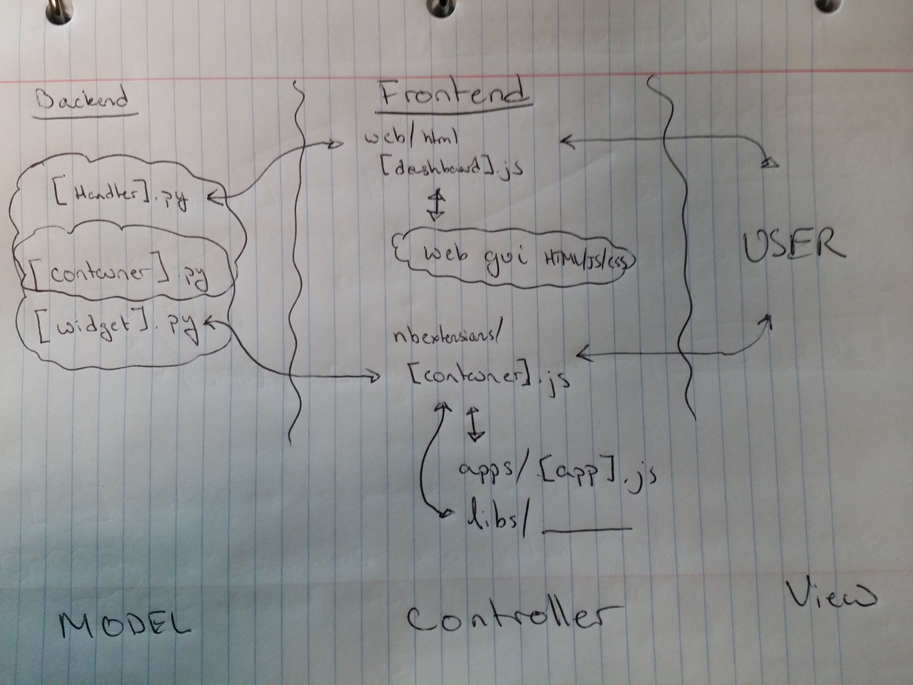

Full Stack Design
======================================
In the graphic below, the technical organization of the code's logic is
described. Specifically, the distribution of communication (between languages)
and structure of GUI related code is given. In a model-view-controller sense
(the model updates the view, the user sees the view, the users interacts with
the controller, the controller manipulates the model, and the cycle repeats),
the model is the (backend) **Python** code, the view is **container.js**,
and the controller is **app.js**. In some cases the controller only
performs aesthetic changes to the view and does not require communication with
the model (note that communication between the controller and model, and model
and view is the most expensive step due to transformation of objects between
languages - usually requiring in memory copies).

Scalability and Compilation
================================================
Efficient distributed and parallelized calculation can be difficult to achieve
in practice. Scalable computations are organized by their ability to be distributed
across multiple (network connected) computers (real or virtual), scalable
across a multicore/multithread CPU and/or GPU, and propensity for ahead-of-time
compilation (AOT) or just-in-time compilation (JIT) to C or C++ code (for example).
The exa package provides the **distributed**, **parallel**, and **compiled**
sub-packages for handling each of these domains. An additional consideration is
out of core (out of RAM) algorithms, handled by the **nomem** package.

From the least to the most computationally efficient, exa leverages:

- python operators, iterators, generators, etc
- numpy/pandas/scipy
- cython/numba
- distributed

For out of core work, exa leverages:

- dask

Because of the inherent inefficiency with out of core algorithms (disk is slower
than RAM), these operations are treated on different footing than in core work;
their performance should not be directly compared.

Python
--------------------
Describe pure python algorithms for dataframe/series (i.e. container) manipulation.

Cython/Numba
---------------------
Describe cythonized/numbafied functions for dataframe/series manipulation.

Distributed
-------------------
Describe multinode algorithms for dataframe/series computations.
