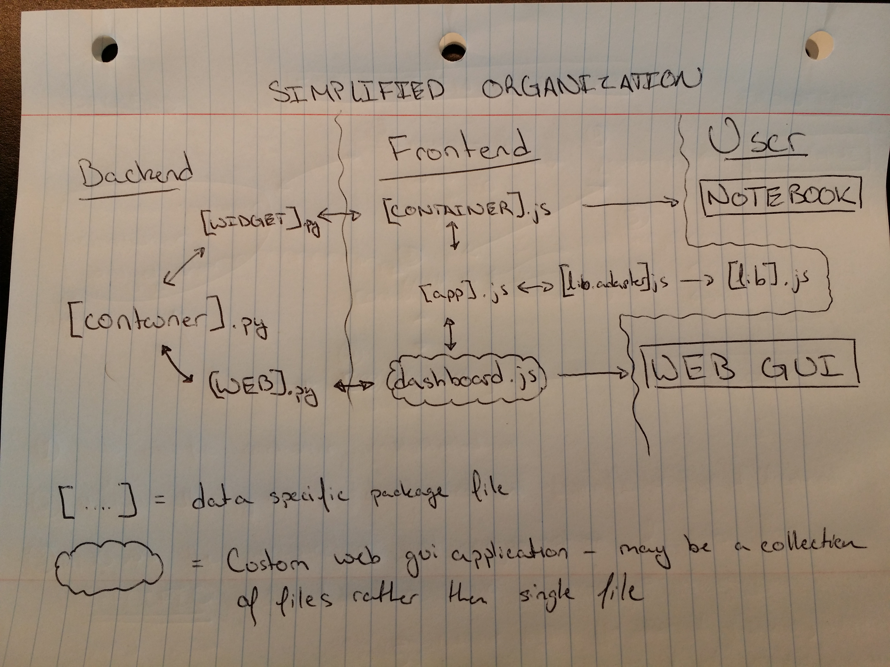
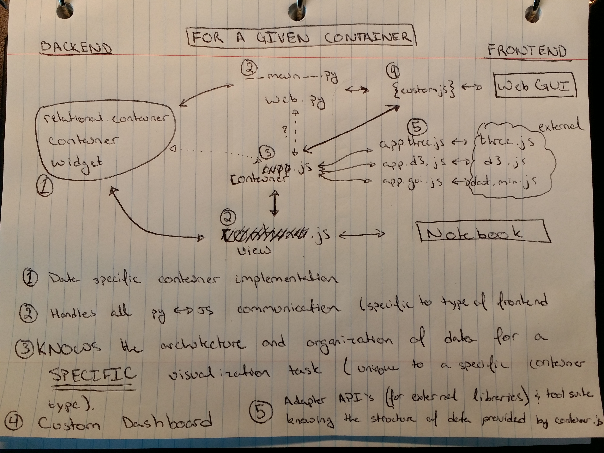

Full Stack Design
======================================
In the graphic below, the technical organization of the code's logic is
described. Specifically, the distribution of communication (between languages)
and structure of GUI related code is given. In a model-view-controller sense
(the model updates the view, the user sees the view, the users interacts with
the controller, the controller manipulates the model, and the cycle repeats),
the model is the back end Python code, the view is the container.js javascript,
and the controller is the appl.js code. In some cases the controller only
performs aesthetic improvements on the view.

Like the above, this figure provides a slightly more detailed view of the
technical organization of the code. Note that the naming scheme selected follows
more closely to the above figure than the one below.

